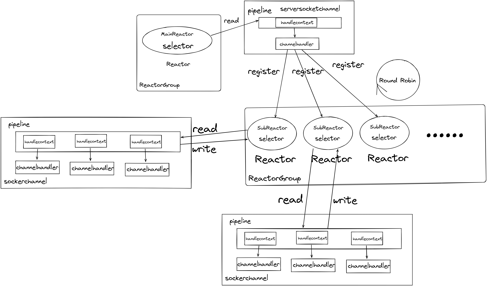
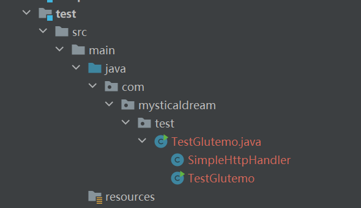
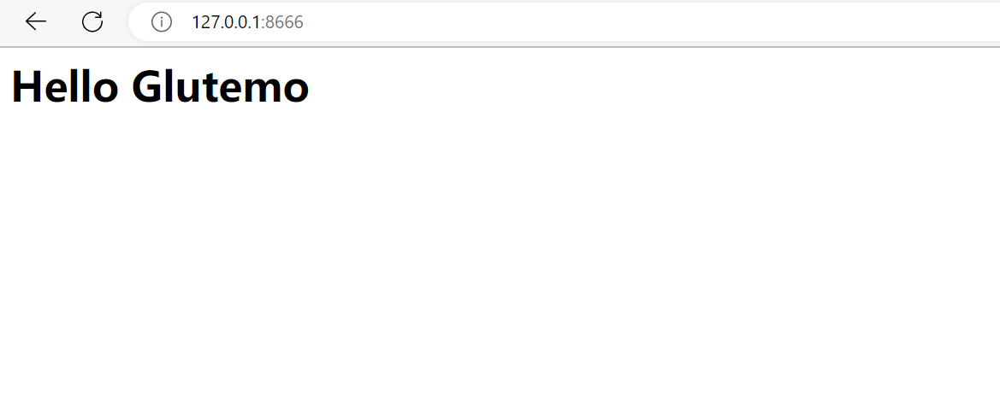

# mysticalweb

> java网络编程学习项目


## 模块

### glutemo(nio框架)

> 这个是一个`nio`项目，封装了`java`中提供的`nio api`,使得`nio`编程更加方便，可以快速通过该框架编写一个基于tcp/ip的服务器。

#### 项目主要组件及模型示意图



#### 功能特点：

- 使用jctools提供的高性能MPSC队列替代JDK提供的队列作为reactor的任务队列,相比JDK提供的并发队列在特定压测环境下性能提升了2~
3倍左右
- 采用了基于事件驱动的设计，可以更方便地处理网络事件。
- 支持单reactor单线程、单reactor多线程和主从reactor模型
- 在主从模式下，主线程负责accept请求并以Round Robin方式分发到对应的IO线程，减轻主线程的压力
- 使用管道模式使其具有较好得伸缩性，可以基于此开发各种二进制和文本协议，例如http

#### 使用

1. 克隆项目:
```bash
git clone https://github.com/MysticalDream/mysticalweb.git
```
2. 在克隆的项目的基础上，新建一个测试maven模块`test`并添加依赖:

```xml
<dependencies>
        <dependency>
            <groupId>com.mysticaldream</groupId>
            <artifactId>glutemo</artifactId>
            <version>1.0.0</version>
        </dependency>
</dependencies>
```
3. 创建一个测试类`com.mysticaldream.test.TestGlutemo`:

```java
public class TestGlutemo {

    public static void main(String[] args) throws IOException {

        //主线程池
        NioReactorGroup bossGroup = new NioReactorGroup();
        //工作线程池
        NioReactorGroup workerGroup = new NioReactorGroup();
        //业务线程池
        SimpleTaskLoopExecutorGroup businessGroup = new SimpleTaskLoopExecutorGroup();

        ServerBootStrap serverBootStrap = new ServerBootStrap(bossGroup, workerGroup);

        serverBootStrap.addServerChannel(new NioServerSocketChannel(), 8666, new ChannelInitializeHandler<AbstractNioChannel>() {
            @Override
            public void initChannel(AbstractNioChannel channel) {
                //管道中添加处理器
                channel.pipeline().addLast(businessGroup, new SimpleHttpHandler());
            }
        });

        serverBootStrap.bind();
    }
}

class SimpleHttpHandler extends ChannelInHandlerAdapter {
    @Override
    public void channelRegistered(ChannelHandlerContext context) throws Exception {
        System.out.println("register...");
    }

    @Override
    public void channelRead(ChannelHandlerContext context, Object msg) throws Exception {

        String responseLine = "HTTP/1.1 200 OK\r\n";
        String responseHeader = "Server: gluttony\r\nContent-Length: {0}\r\nContent-Type: text/html;charset=utf-8\r\n\r\n";
        String body = "<h1>Hello Glutemo</h1>";
        int contentLength = body.getBytes(StandardCharsets.UTF_8).length;
        String fullHttpMessage = responseLine + MessageFormat.format(responseHeader, contentLength) + body;
        ChannelPromise channelPromise = context.writeAndFlush(fullHttpMessage.getBytes(StandardCharsets.UTF_8));
        channelPromise.then((promise) -> {
            System.out.println("write success");
            return null;
        }).exceptionCatch((e) -> {
            System.err.println(e.getMessage());
            return null;
        });
    }

    @Override
    public void exceptionCaught(ChannelHandlerContext context, Throwable throwable) throws Exception {
        System.err.println(throwable.getMessage());
    }

}
```

4. 运行并在浏览器访问`127.0.0.0:8666`或`localhost:8666`




### minplete (待完善)

> 这个是一个依赖于 `glutemo` 项目的web服务器

